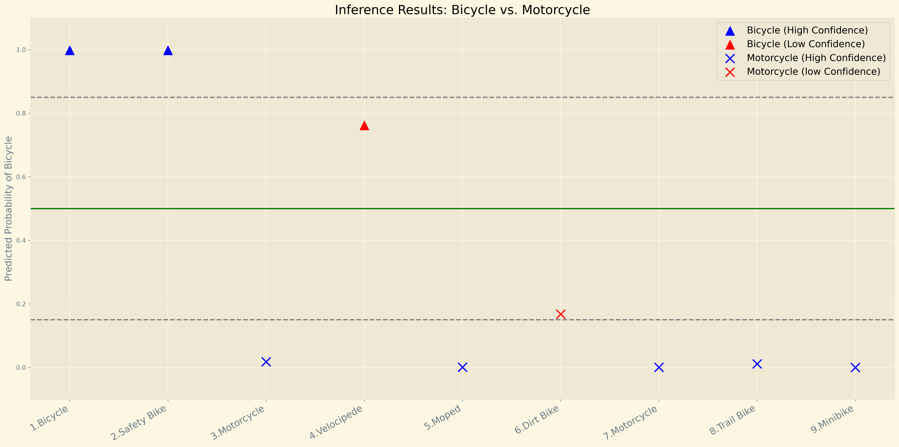

# **Build a ML Workflow for Scones Unlimited on AWS SageMaker**

## 🚲 Project Overview

This project is part of the Udacity AWS Machine Learning Engineer Nanodegree. It demonstrates a Machine Learning (ML) pipeline using AWS SageMaker for image classification, AWS Lambda functions for model deployment, and AWS Step Functions for orchestrating the model workflow. The model distinguishes between **bicycles** and **motorcycles**, helping optimize delivery routing for Scones Unlimited.

## 📜  Steps Summary

1. **Data staging:** Upload a dataset with labeled images of bicycles and motorcycle to an S3 bucket.
2. **Model training and deployment:** Run the training job using an Image classifier model in AWS SageMaker. Create a SageMaker endpoint for real-time inference.
3. **Lambdas and step function workflow:** Deploy Python scripts for image serialization, classification, and inference filtering. Orchestrate the ML pipeline using AWS Step Functions.
4. **Testing and evaluation:** Visualize the inference performance for production use.
5. **Cleanup cloud resources:** Delete AWS resources to avoid additional running costs.

## 📈 Results

1. **Workflow Execution:** 

The screenshot above shows the Step Function workflow successfully executing without any errors. 

The screenshot above demonstrates the workflow where inferences with predicted probabilities falling below the 0.85 confidence threshold were filtered out.

2. **Inferences Confidence Threshold Monitoring:** 

Out of ten inferences, two did not meet the model's confidence threshold of 0.85. However, the majority of predictions have a high confidence score above 0.9, indicating strong model performance.

3. **Each Inference Predicted Propobality of Bicycle Class Results:** 

When measuring the probability of the "bicycle" class, all bicycle objects were correctly classified. Since the model was trained with only two classes (bicycle and motorcycle), the probability of "motorcycle" is calculated as `1 - probability of bicycle`. Consequently, objects that are not bicycles are classified as motorcycles. The plot shows that the model is highly accurate, with most bicycle predictions close to 1.0 and most motorcycle predictions close to 0.0.

